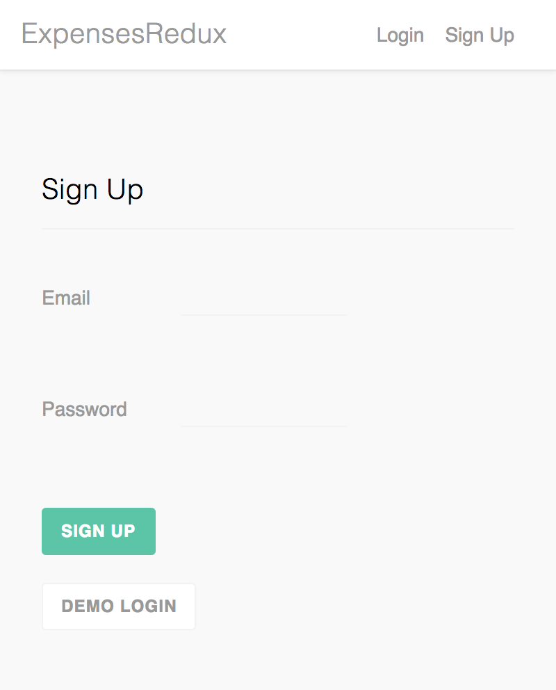
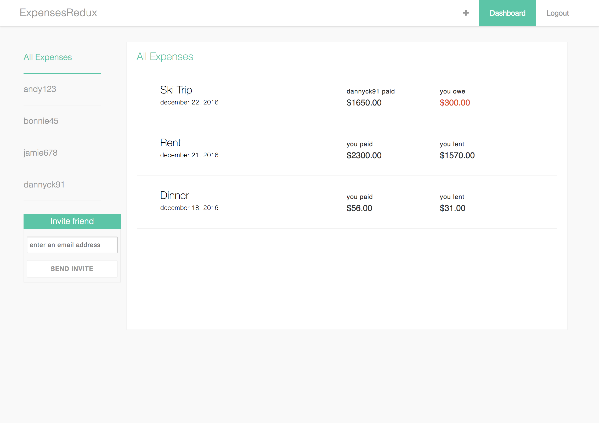

A SplitWise Clone built with React, Redux, Rails and Postgres:
Users can invite friends, and record expenses, split equally, by exact amount, or by percent.

* Unit tests with mocha and expect on calculator functions.
* Atomic Design influences on React components file structure and relation.
* Not a responsive design; may not display well on your device/browser/etc.

# Login Methods
***

# Split Calculator
***

# Dashboard of Shared Expenses
***

